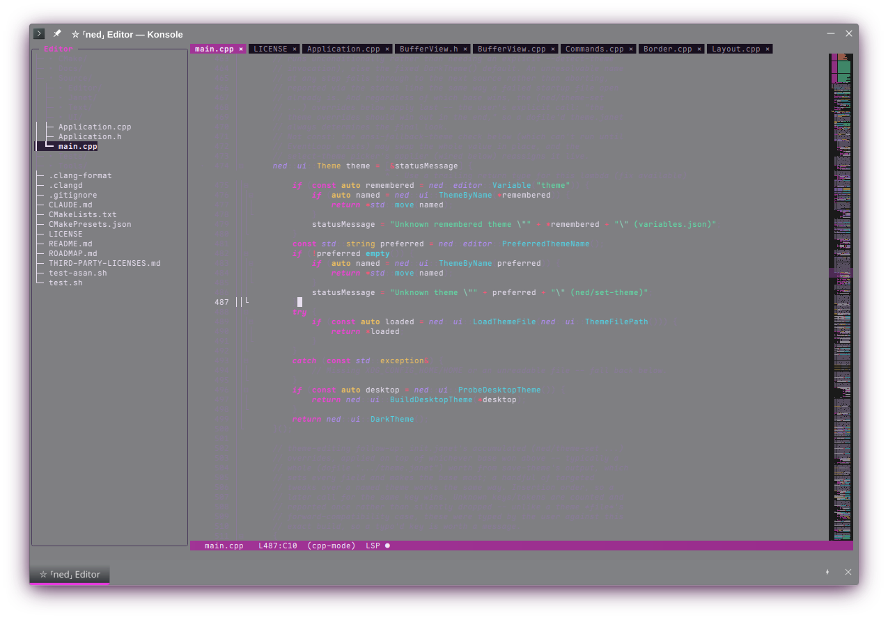

# Ned

[](https://github.com/SuperFes/ned/actions/workflows/build-test.yml)
[](https://superfes.github.io/ned/)
[](LICENSE)


A terminal-based text editor written in modern C++23, aiming for Emacs-class feature
coverage with [Janet](https://janet-lang.org/) filling the role Elisp plays in Emacs —
the editor is scriptable and extensible throughout (buffers, commands, keymaps, modes,
LSP/DAP/VCS/task-runner configuration), not a fixed app with a config file bolted on.
The terminal UI is a from-scratch widget/layout/event-loop layer built directly on
[Notcurses](https://github.com/dankamongmen/notcurses).



**[Read the docs →](https://superfes.github.io/ned/)** — a
[User Guide](https://superfes.github.io/ned/user/) (installation, configuration, every
feature) and [Developer Docs](https://superfes.github.io/ned/dev/) (architecture deep
dives and capability audits), both built from this repository on every push.

## Features

- **Buffers, kill-ring, undo tree, isearch, query-replace, registers, rectangles,
  multiple cursors** — the core Emacs-class editing vocabulary.
- **Janet scripting throughout** — commands, keybindings, modes, and most editor
  settings are reachable from a `~/.config/ned/init.janet`, not a fixed config format.
- **Tree-sitter syntax highlighting, folding, and smart indentation** for 24 bundled
  languages — see [Language Support](https://superfes.github.io/ned/user/language-support.html)
  — with per-capture-name theming.
- **LSP and DAP clients** for language server features (diagnostics, completion, code
  actions, go-to-definition, scope-aware rename) and debugging (breakpoints, stepping,
  variable/memory inspection, reverse execution where the adapter supports it).
- **VCS integration** through a provider-agnostic plugin interface (bundled reference
  implementation for git) — blame, log, diff, stage/unstage (including per-hunk),
  commit, branches.
- **Full Vim modal-editing emulation**, off by default (`ned/set-vim-mode`), alongside
  ned's own Emacs-style bindings.
- **Snippets** (TextMate-style tabstops, hand-registered or from a language server),
  a built-in terminal panel (libvterm-backed), task/test runners, and Emacs-style
  recursive window splitting.
- **Agent Client Protocol (ACP) support** for a conversational coding agent, plus an
  MCP bridge letting a connected agent query ned's own diagnostics/definitions/search.
- **Org-mode-style structured editing** — headlines, TODO states, scheduling/clocking,
  checkboxes, tables, links, project-wide agenda — plus GFM table editing for Markdown.
- **Project-wide search/replace, a file sidebar, session persistence** (restores open
  files, point, and window layout per project), and a handful of bundled/clonable
  color themes — see [Theming](https://superfes.github.io/ned/user/theming.html).

See [`ROADMAP.md`](ROADMAP.md) for what's still open.

## Requirements

- CMake 3.29+
- Clang (the documented build uses Clang + LLD explicitly — see `CMakePresets.json`)
- [Janet](https://janet-lang.org/), built from its pinned version (not packaged for most
  distributions)
- [Notcurses](https://github.com/dankamongmen/notcurses) v3.0.17 exactly, with three
  small input-handling patches ned carries (`Patches/notcurses/`)
- System packages for `libutf8proc`, CLI11, `nlohmann/json`, RE2, PCRE2, `libvterm`,
  and Catch2 (tests) — no `FetchContent` network fetch for any of these

Every bundled tree-sitter grammar is vendored under `ThirdParty/tree-sitter-grammars/`
and checked into the repository, so an ordinary build touches no network beyond the
initial `git clone`. See the
**[Installation guide](https://superfes.github.io/ned/user/installation.html)** for the
exact package names per distribution and the Notcurses patch recipe.

## Build

```sh
cmake --preset default   # Clang + LLD; see CMakePresets.json
cmake --build build
./build/ned
```

Run the test suite with `ctest --test-dir build`.

## Status

Under active development. Real, daily-usable, and extensively tested (4400+ tests via
`ctest`), but pre-1.0 — the Janet API surface, config file formats, and keybindings may
still change. See [`ROADMAP.md`](ROADMAP.md) for what's open next.

## License

MIT — see [`LICENSE`](LICENSE). Third-party dependency licenses are listed in
[`THIRD-PARTY-LICENSES.md`](THIRD-PARTY-LICENSES.md).
